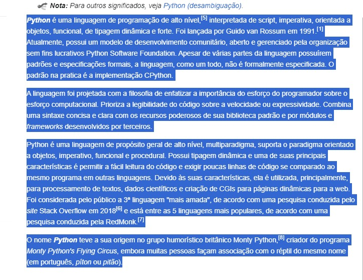
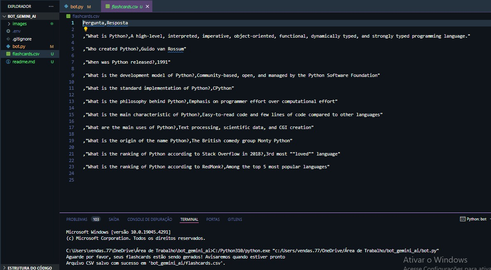
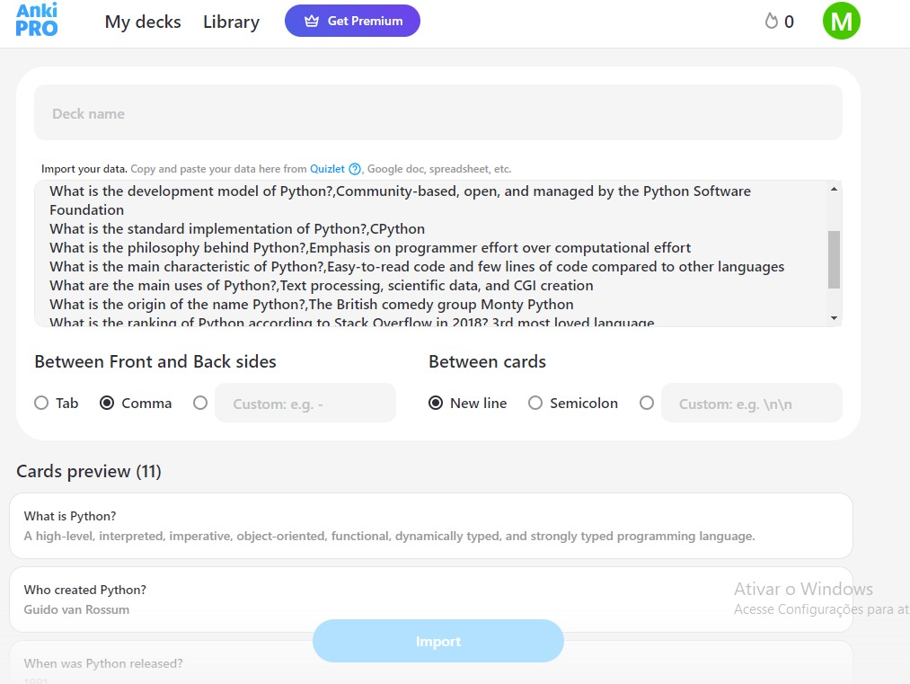
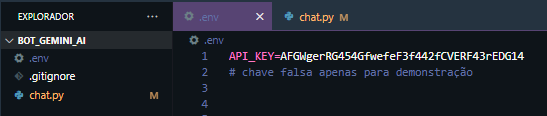

<h1 align="center">
Gerador de flashcards para o Anki Pro com API do Gemini
</h1>

   

### Tópicos 

:small_blue_diamond: [Descrição do projeto](#descrição-do-projeto)

:small_blue_diamond: [Funcionalidades](#funcionalidades)

:small_blue_diamond: [Resultado](#resultado)

:small_blue_diamond: [Pré-requisitos](#pré-requisitos)

# Descrição do projeto 

[Artigos](https://drive.google.com/file/d/11smG-0uuOc8PU2Z0FMewuRjYac0XCmz-/view?usp=sharing) comprovam que o estudo por repetição espaçada é um dos mais eficazes quando se trata em não esquecer o conteúdo. Consiste em relembrar o que foi estudado, com flashcards resumidos, a cada certo periodo de tempo. No link a seguir tem uma ótima explicação sobre [repeticao espaçada.](https://www.freecodecamp.org/portuguese/news/como-utilizar-a-repeticao-espacada-com-o-anki-para-aprender-a-programar-mais-rapidamente/) 

<strong style="font-size:18px;">Minha motivação</strong> para desenvolver esse pequeno projeto na imersão I.A da Alura, foi porque eu mesmo utilizo o Anki Pro para meus estudos, e precisava investir um certo tempo para criar os cards manuais quando o assunto é extenso. Como é possível importar cards em massa com o Anki, pensei em passar essa tarefa para a I.A, que pode me entregar o arquivo pronto em CSV.

# Funcionalidades

:heavy_check_mark: Antes de rodar o código, caso seu texto já não esteja assim, recomendo que peça antes para uma I.A como o Gemini, resumi-lo previamente, isso ajuda muito com que o código retorne bons flashcards.  

:heavy_check_mark: Este script Python foi desenvolvido para automatizar a geração de flashcards no formato CSV utilizando a API do Gemini AI.     

:heavy_check_mark: Salva o conteúdo em um arquivo CSV chamado 'flashcards.csv.'  

:heavy_check_mark: Exibe uma mensagem no console indicando o sucesso da operação e o local onde o arquivo CSV foi salvo.  

:heavy_check_mark: Nem sempre será gerado um arquivo como queremos, isso se deve aos modelos de I.A. que incluem componentes de aleatoriedade em seus processos de geração de texto, o que pode levar a respostas diferentes, mesmo com o mesmo prompt. Se a resposta não sair como o esperado, basta tentar novamente. 

# Resultado

Por enquanto o código roda somente no console, de preferência utilizando O VScode como IDE. Em breve o código será aprimorado, juntamente com o deploy online.

<strong>Texto que gerou o resultado, não foi feito nenhuma preparação prévia, por ser um texto pequeno.</strong>

<strong>Resultado com o arquivo gerado, o texto e a mensagem no console.</strong>

<strong>Importando no app Anki Pro</strong>  
[Link do deck gerado no Anki](https://ankipro.net/shared_deck/hs6xeeFF)  

# Pré-requisitos

Você precisa criar no VScode um arquivo com o nome '.env', e colocar nele uma variável de ambiente que contenha a sua API do Gemini, assim seguimos a boa prática de não deixar a chave privada visível.

:small_blue_diamond: <strong style="font-size:24px;">Dependências</strong>

<strong style="font-size:18px;">google.generativeai:</strong> Biblioteca que fornece acesso à [API do Gemini AI.](https://ai.google.dev/gemini-api/docs/get-started/python)  
<strong style="font-size:18px;">pyperclip:</strong> Utilizada para acessar o conteúdo da área de transferência.  
<strong style="font-size:18px;">io:</strong> Utilizada para operações de entrada/saída.  
<strong style="font-size:18px;">csv:</strong> Biblioteca para manipulação de arquivos CSV.  
<strong style="font-size:18px;">os:</strong> Usada para acessar variáveis de ambiente.  
<strong style="font-size:18px;">dotenv:</strong> Biblioteca para carregar variáveis de ambiente de um arquivo .env.  

É necessário instalar separadamente as seguintes depêndencias, basta colar no terminal:  
pip install -q -U google-generativeai  
pip install pyperclip  
pip install python-dotenv  

# Desenvolvedores/Contribuintes

[ Matheus Saggiorato da Silva](https://github.com/MatheusSaggiorato)
